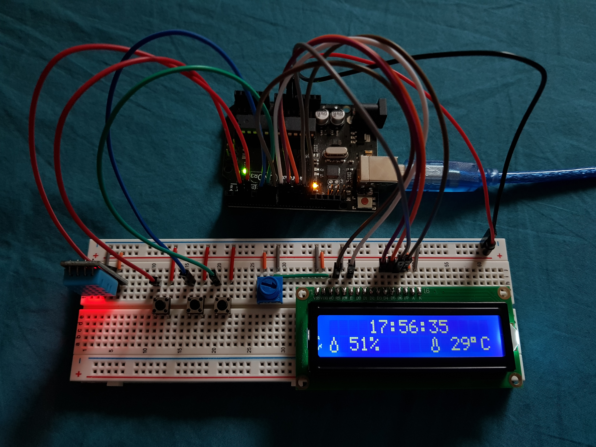

# Clock without RTC module based on an Arduino

This is my first Arduino based project through which I learned a bit about the micro-controller. I purchased an Arduino kit and it came with a few sensors and some instructions. Out of curiosity I decided to make a clock with the LCD display that came included and found out that a Real Time Clock (RTC) module would be the easiest way to make one. Since my kit lacked said module, I decided to make the clock without one and also decided to include real time temperature and humidity data using the DHT11 sensor.

**Required Parts:**
* Arduino Uno 
* Breadbord
* LCD 16x2
* 3x pushbuttons
* Jumper cables
* 50k Potentiometer
* DHT 11 Temperature and Humidity Sensor

**Arduino Code:**
'''
#include <LiquidCrystal.h>
#include <dht11.h>

int sec=0,minute=0,hour=0, startstop=1;
//buttons config
int hourbutton=5;
int minbutton=6; 
int startbutton=2;
int buttonState1=0;
int buttonState2=0;

//temperature and humidity sensor
dht11 DHT;
int temp=0,hum=0;
const int dht11_data=3;

LiquidCrystal lcd(7,8,9,10,11,12);

//Glyph data
byte therm[8] = {
  B00100,
  B01010,
  B01010,
  B01010,
  B01010,
  B10001,
  B10001,
  B01110
 };

byte drop[8] = {
  B00100, 
  B00100, 
  B01010, 
  B01010,
  B10001,
  B10001,
  B10001,
  B01110
};

void setup()
{
  lcd.createChar(1,drop); 
    lcd.createChar(2,therm);
    lcd.begin(16,2);
    lcd.print("Welcome Gousheeg");
    delay(2000);
    lcd.clear();

    pinMode(minbutton, INPUT_PULLUP);
    pinMode(hourbutton, INPUT_PULLUP);
    pinMode(startbutton, INPUT_PULLUP);

  attachInterrupt(digitalPinToInterrupt(2),button1,FALLING);
}

void loop()
{
  while(startstop==1)
  {
      DHT.read(dht11_data);
      temp=DHT.temperature;
      hum=DHT.humidity;

      lcd.setCursor(0,1);
      lcd.write(byte(1));
      lcd.print(" ");
      lcd.print(hum);
      lcd.print("%");

      lcd.setCursor(10,1); 
      lcd.write(byte(2));
      lcd.print(" ");
      lcd.print(temp);
      lcd.write(0xDF);   
      lcd.print("C");

    sec+=1;

    if(sec==60){
    minute+=1;
    sec=0;
    }

    if(minute==60){
    hour+=1;
    minute=0;
    }

    if(hour==24){
    minute=0;
    hour=0;
    }

    lcd.setCursor(4,0); 
    lcd.print(hour); 
    lcd.print(":"); 
    lcd.print(minute); 
    lcd.print(":"); 
    lcd.print(sec); 
    delay(1000); 
  }

  while(startstop==0){
    sec=0;
    buttonState1=digitalRead(hourbutton);
    buttonState2=digitalRead(minbutton);
    
    if(buttonState1==LOW){
      hour+=1;
      if(hour==24){hour=0;}
    }

    if(buttonState2==LOW){
      minute+=1;
      if(minute==60){minute=0;}
    }
    

    lcd.setCursor(0,0);
    lcd.print("Set Time");
    lcd.setCursor(4,1); 
 
    lcd.print(hour); 
    lcd.print(":"); 
    lcd.print(minute); 
    lcd.print(":"); 
    lcd.print(sec); 
    delay(200);
  }
}

//ISR
void button1(){
  lcd.clear();
  startstop^=1;
}
'''

**References:**
* https://www.arduino.cc/en/Tutorial/DigitalInputPullup
* https://www.arduino.cc/en/Reference/LiquidCrystal
* https://maxpromer.github.io/LCD-Character-Creator/
* https://easyeda.com/
